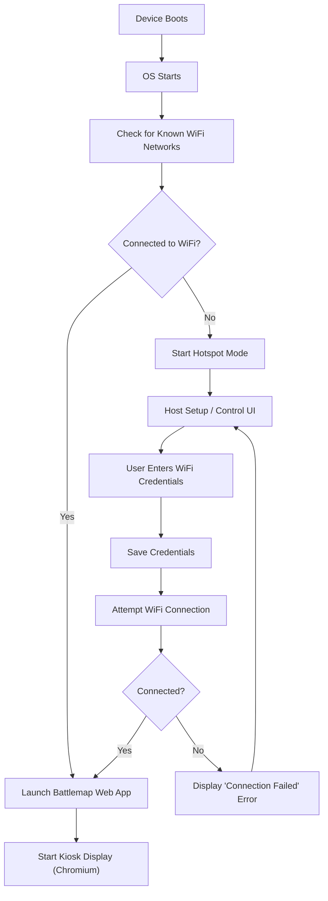

# Kalfiz Major Image

## Project Overview/Goals

The goal of this project is to create a lightweight, local-first wireless monitor display that is powered by a Raspberry Pi to show images (mostly battlemaps) for a simple VTT to be used for miniatures to be placed on for tapletop games such as dungeons and dragons.

As a user of this product, I want to be able to take it to any location that has a wifi network, set up the Raspberry Pi to connect to that wifi (if it hasn't already) via a laptop or other device, then visit a website emitted by the Pi for controlling the images that are displayed on screen.

I would like people to be able to clone this repo and put it on their raspberry pi, hook it up to a monitor, power it on and have it just work with as little friction as possible.

The Raspberry Pi will have the following hardware:

* Raspberry Pi 4 Model B
* 4GB RAM
* Wifi capability
* 32 GB Micro SD Card
* Connected to a 32 inch 1440p monitor

## High Level Requirements

1. **Network Agnostic, Minimal Friction Network Setup** - This device will be portable across multiple locations. General behavior should be as follows when powered on:

    * If the Raspberry Pi has connected to the wifi network before, it should automatically connect on startup and start up necessary services for the VTT display.
    * If the Pi cannot connect to wifi, it will display a message on the monitor for instructions with a url/ip address to provide credentials, and start up a web server to provide those instructions to the Pi, then once it has connected, will boot the app

2. **Real Time Image Display and Customization** - Images chosen via the web UI will display in real time on the screen after a confirmation prompt

    * Images will display in a lightweight view on a monitor connected to the Rasperry Pi
    * Toggle a grid overlay on atop of each image, that is configurable to better match each image being displayed
    * Images should be sized appropriately to the monitors resolution as close as possible to not distort the image. "Right sized" tooling, or a zoom feature may be implemented

3. **On Device Image Management** - Easy, intuitive UI and tooling for CRUD operations on images.
    * Images will be stored locally ont he raspberry pi using an SD card.
    * Images cna be uploaded tot he raspberry pi SD Card to be displayed and modiifed later
    * Image files can be renamed
    * Should accept jpg, png, mp4, gif, webp files
    * Images can be previewed before selecting
    * Images can be organized into folders, copies made and movd to another location on the drive, etc
    * If a USB is plugged into the Pi, the images can be loaded from that.

## Technical Architecture (needs refinement)

I am envisioning 3 services all interacting with one another on one machine:

1. A wifi provisioner tool
2. A battlemap ui and image-manager-lite webapp of sorts
3. A kiosk display reading from state controlled by the battlemap UI

The general mental model is a two-mode boot system, where the Pi will either boot into a wifi provisioning portal or the battlemap runtime depending on connectivity at startup.

### Wifi Provisioner

* Emits a wifi hotspot to connect to
* Will display instructions on the monitor screen
  * "Connect to this device via wifi: {NAME}"
  * Navigate to {ADDRESS} in your browser
  * Log into Wifi
* Should emit a lightweight simple UI for entering wifi credentials and saving them on disk/OS via an endpoint
* When finished and a wifi connection is detected, the Pi will start the battlemap and kiosk display service

### Battlemap UI Webapp

* When connected to a wifi network, will boot up a UI and server that is used to:
  * Browse images on disk
  * Rename images on disk
  * Create folders of images on disk
  * Delete iamges on disk
  * Update teh currently showing image on teh kiosk display
  * Upload images to disk
* Will show a grid toggle and customization options (size, offset etc)

### Kiosk Display

* When connected to a wifi network, will show the image selected from teh UI in a chromium kiosk mode on the connected display monitor
* When not connected to a wifi network, will show instructions on how to setup a wifi connection to the raspberry pi's hotspot for wifi setup

### Technical Diagram Flowchart

### Stack Considerations (needs refinement)

* All server side work will be done in Python
  * FastApi stack
  * uv for package manager
  * pyrpoject.toml for toml file
* All UI work will be done in Svelte
  * Consider using Sveltekit
  * tanstack query for svelte for caching/fetching data
  * the wifi setup can be a basic html/css served via python
  * consider using a lightweight svelte ui library for pre built components and simple UX
  * no real branding to worry about quite yet
* All images will be stored on disk, the UI when interacting with images should be representative of the disk structure
  * Image files can be held in a separate partition if thats easier/more secure
  * The web UI should consider if USB 
* The battlemap API should serve as a means to interact with the state machine that determines which image is being shown in what way
  * The image display state could be held in memory, there is no need to persist it across sessions. Perhaps as just a python class or a json file that get updated in real time to serve as a transient database?
* A websocket can be used to update the image/grid overlay when the state machine changes
* Consider using any python libraries that might aid with this
* The API can be served via Docker with persistent storage on disk
* OS level scripts can just use bash a means of interacting with the PI system in terms of booting, starting docker images, checking and connecting to wifi networks, etc

### Local Developmen

I would like to make use of dev containers for an isolated dev environment via vscode for this. I have very little knowledg of these and have not used them before.

### Open Questions

* Will React be lightweight enough to be hosted on this? it is just what i am familiar with but i want to learn svelte
* Should this run on raspberry pi OS or should i boot a linux distro onto it? ubuntu server? i want minimal configuration before developing
